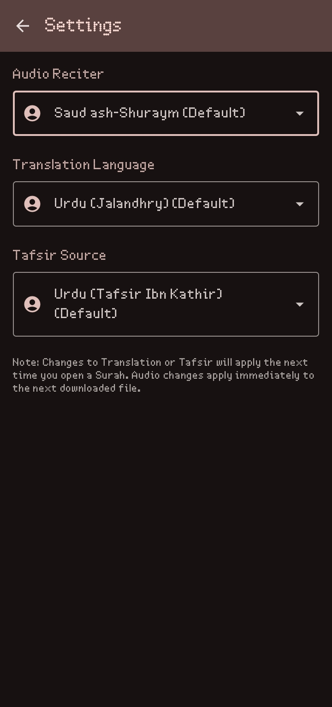
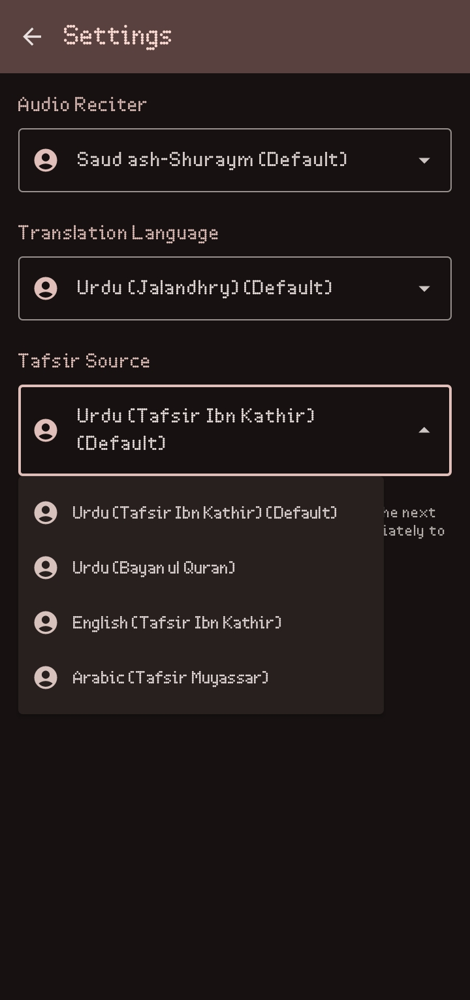
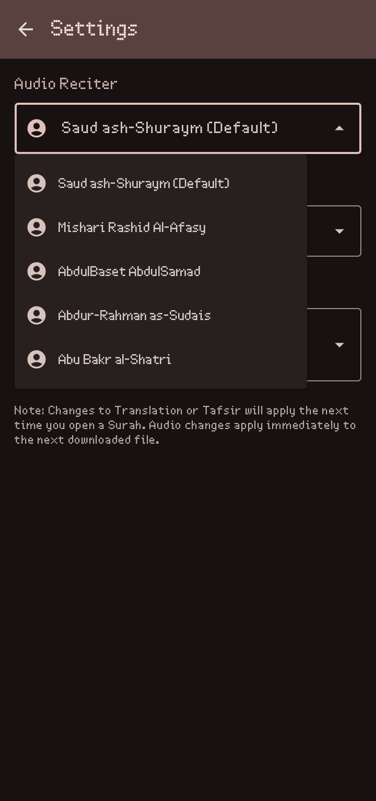
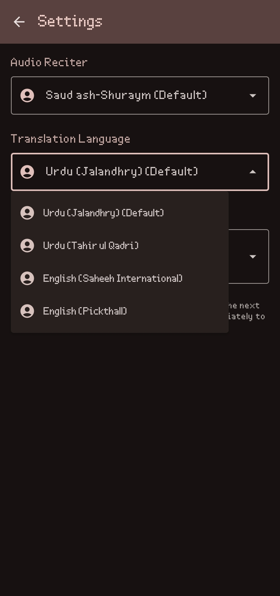
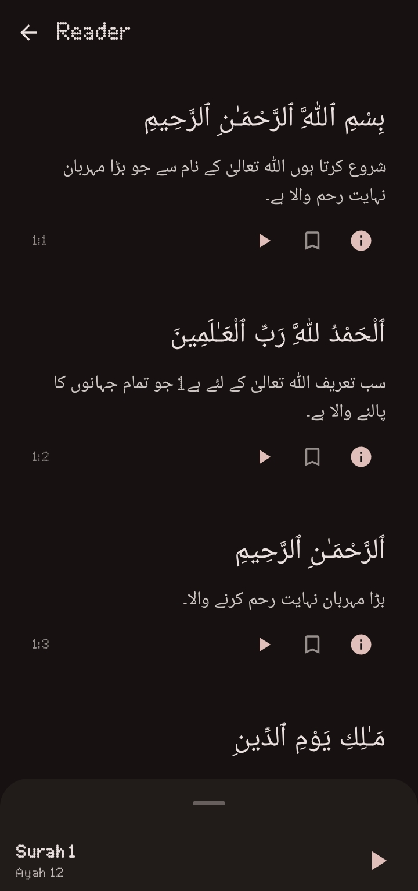
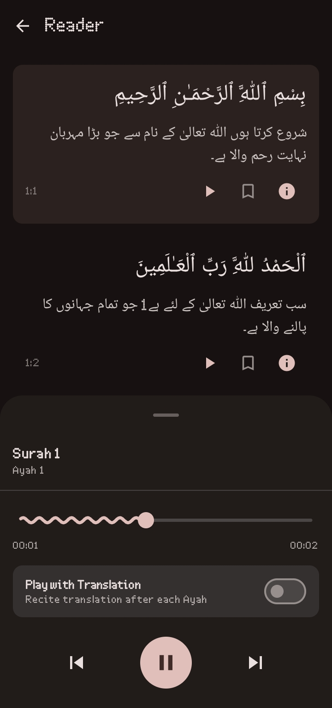
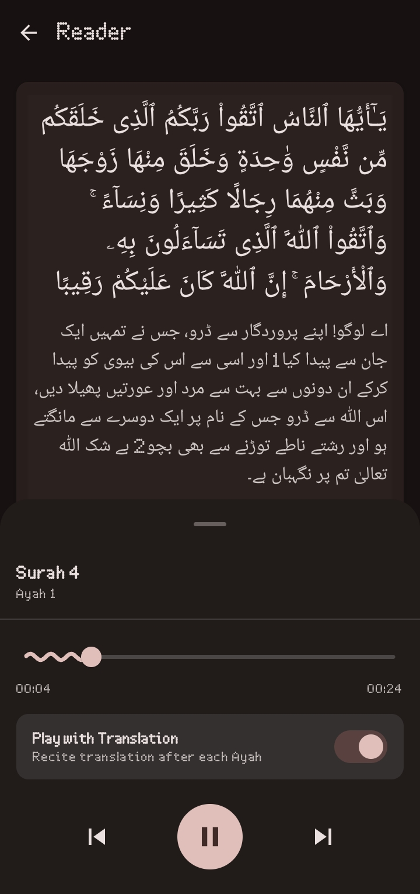

# Quran Majeed (قرآن مجید)

<div align="center">
  
  
  <br/>
  
  **An elegant, privacy-respecting, and beautifully crafted Open Source Quran App for Android.**
  
  [](https://opensource.org/licenses/MIT)
  [](https://developer.android.com/about)
  [](#downloads--releases)
  [](#downloads--releases)
</div>

<br/>

## 🌟 Features
* **Beautiful, Distraction-Free Reading:** Enjoy an elegant infinite scroll reading experience with authentic typography.
* **Smart Audio Player:** Syncs automatically with the current Ayah and features interactive playback controls. Supports multiple world-renowned reciters (e.g., *Mishari Rashid Al-Afasy*, *Saud Ash-Shuraym*).
* **Deep Offline Capabilities:** Read Surahs, Translations, and Tafsir without an internet connection once synced.
* **Premium Home Dashboard:** Quickly resume exactly where you left off.
* **Daily Hadith Widget:** A stunning homescreen widget highlighting a daily Hadith, delivered locally without any Google Play Services tracking.
* **Multiple Languages & Tafsirs:** Choose from popular Urdu (Jalandhry, Tahir ul Qadri) and English translations, as well as renowned exegesis like Tafsir Ibn Kathir.
* **100% Privacy Respecting:** No tracking, no ads, and no reliance on proprietary Google services.

---

## 📱 Screenshots

<div align="center">
  
  
  
  
  
  
  
  
  
  
  
  
</div>

---

## 📥 Downloads & Releases

Because **Quran Majeed** respects user privacy and avoids tracking, it is designed perfectly for open-source stores.

### 1. F-Droid (Main)
*Submission is currently pending in the main F-Droid repository.*

<a href="#">
  
</a>

### 2. IzzyOnDroid
You can download the latest official release directly from IzzyOnDroid.
*(Link will be available here once approved by the Izzy repo)*

<a href="https://apt.izzysoft.de/fdroid/index/apk/com.haseeb.quranapp">
  
</a>

### 3. GitHub Releases (Direct APK)
If you don't use F-Droid, you can grab the raw `app-release.apk` directly from our Releases Page.

<a href="https://github.com/muhammadhaseebiqbal-dev/QuranMajeed/releases/latest">
  
</a>


---

## 🛠️ Building from Source

This app uses modern Android development practices (Kotlin, Jetpack Compose, Hilt, Room, Media3).

1. Clone the repository:
   ```bash
   git clone https://github.com/YourUsername/QuranApp.git
   ```
2. Open the project in **Android Studio** (Flamingo or newer).
3. Let Gradle sync project dependencies.
4. Build the project using:
   ```bash
   ./gradlew assembleDebug
   ```

*(Note: API data is sourced ethically from [Quran.com API v4](https://quran.com/api/v4) and audio from Al Quran Cloud / EveryAyah).*

---

## 🖋️ License
This project is completely free and open source under the MIT License. May it be a source of continuous charity (Sadaqah Jariyah) for everyone involved.
